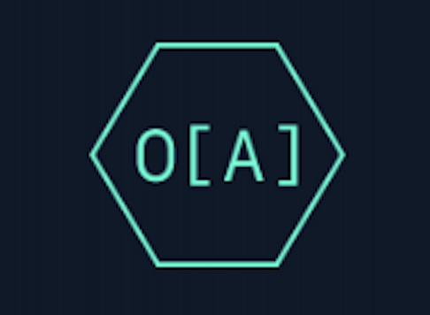
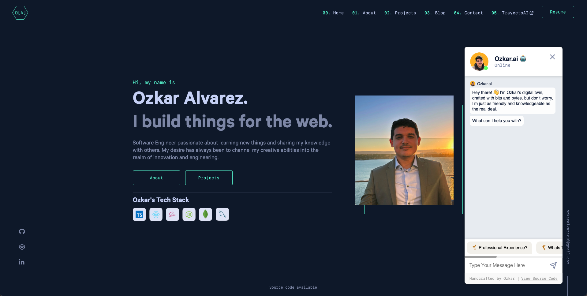
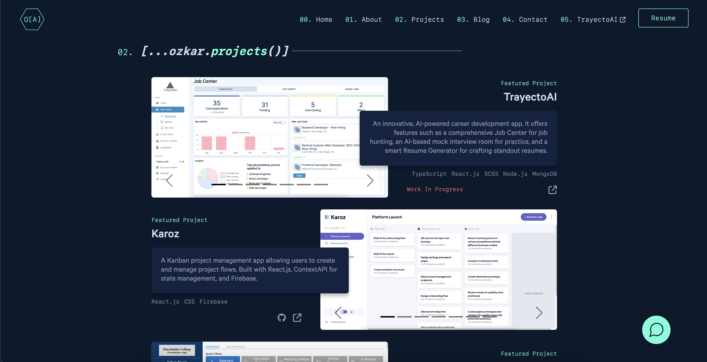
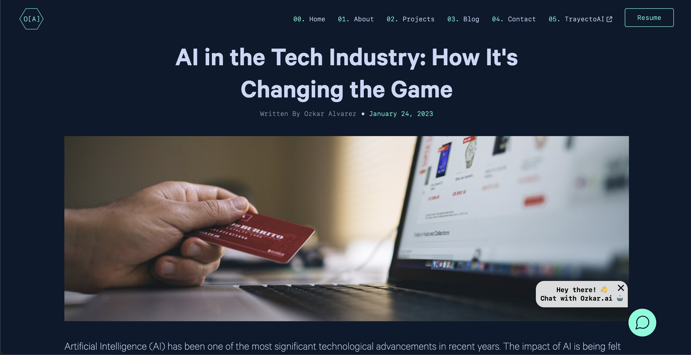
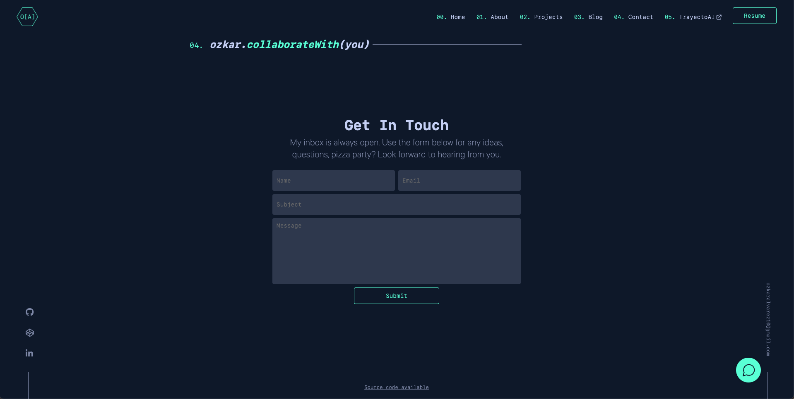

# [ozkaralvarez.com](https://ozkaralvarez.com)

This site showcases my professional skills, projects, and personal journey as a software developer. It serves as a digital footprint of my accomplishments and a platform for potential employers and collaborators to explore my work.

## 🚨 Design Credits and Usage Rights
I'm excited to share that the visual design of this portfolio was inspired by the incredibly talented [Brittany Chiang](https://github.com/bchiang7/v4?tab=readme-ov-file). While Brittany laid the groundwork with her stunning design, I, Ozkar Alvarez, have crafted the code for this React Application from the ground up. It's been a wonderful journey meshing her design with my coding.
If you're as impressed with Brittany's design as I am and considering using it, don't forget to check out her [guidelines](https://github.com/bchiang7/v4?tab=readme-ov-file#-forking-this-repo-please-read) on how to do so respectfully.

## Features

* **Interactive Chatbot:** Features a custom-built chatbot powered by a fine-tuned OpenAI language model, offering personalized interactions and insights into my work and experiences.
* **Projects Page:** This page is meticulously curated to highlight the breadth and depth of my expertise, featuring detailed descriptions, technologies used, and links to live demos or repositories for each project.
* **Blog Page:** An insightful blog where I share my thoughts, experiences, and knowledge in software development.
* **Contact Form:** Facilitates easy communication for professional inquiries.
* **Responsive Design:** Ensures a smooth and consistent user experience across various devices.

## Screenshots

### Interactive Chatbot
Using a fine-tuned OpenAI language model, the chatbot provides a unique and interactive way for visitors to learn about my projects and experiences.
This screenshot also captures the essence of the homepage on [ozkaralvarez.com](https://ozkaralvarez.com). It features a prominent main heading that introduces me and sets the tone for the site.

  

### Projects Page
Each featured project is presented with a prominent design, highlighting key aspects and achievements of these major works. Other notable projects are also displayed in a more subtle manner, providing a comprehensive view of my portfolio. This page is carefully organized to showcase the diversity and scope of my skills and experiences in software development.

### Blog Post
This screenshot captures an individual blog post on ozkaralvarez.com, exemplifying the seamless integration with the custom-built, [headless CMS](https://github.com/oalva-rez/portfolio-api) backend. The blog infrastructure not only supports content management but also allows for the inclusion of SEO and meta information for each post.

  

### Contact form
The backend of this page is powered by a private Node.js application, ensuring secure and efficient handling of user inquiries and communications. This setup reflects my commitment to creating robust, user-friendly interfaces backed by reliable and secure server-side technologies.

  

## Technologies Used

* **Frontend Development:** Utilizes React.js, SCSS and React Router v6 for a sleek and modern interface.
* **Backend Integration:** Employs a [headless CMS](https://github.com/oalva-rez/portfolio-api) for the blog post data along with a [chatbot backend service](https://github.com/oalva-rez/portfolio-chat-bot) that powers Ozkar.ai.
* **Responsive Design:** Fully adaptable to various devices and screen sizes, ensuring a consistent and accessible experience across desktop and mobile platforms.
* **SEO Optimization:** Implemented to enhance site visibility on search engines.
* **Analytics:** Tracks visitor behavior and site performance for continual improvement.

## Proper Use and Credits (Applies to Chatbot Component Only)
I am delighted to share my work with the wider community and appreciate your interest in using it. To ensure that my work is used responsibly and with appropriate acknowledgment, please adhere to the following guidelines:

### Usage Guidelines
1. **Educational and Non-Commercial Use:** You are encouraged to use this backend application for educational purposes and non-commercial projects. For any commercial use, please contact me directly for permission.

2. **Code Modification:** While you are free to modify and adapt the code for personal use or contribution to the project, any public distribution of the modified code should clearly reference this original repository.

### Crediting
When using or referencing my work, proper credit should be given. This can be done in the following ways:

1. **In Documentation:** If you're using parts of the code or the entire project in your work, please include a reference to this repository in your project's documentation.

2. **In Publications or Presentations:** For any academic or professional publications, presentations, or articles that include results or insights gained from this project, a citation or acknowledgment is appreciated.

3. **On Web Platforms:** When showcasing projects that include this backend or its elements on web platforms (like GitHub, personal websites, or social media), please provide a link back to this repository.

## License
This work is licensed under a [Creative Commons Attribution-NonCommercial 4.0 International License](http://creativecommons.org/licenses/by-nc/4.0/).

